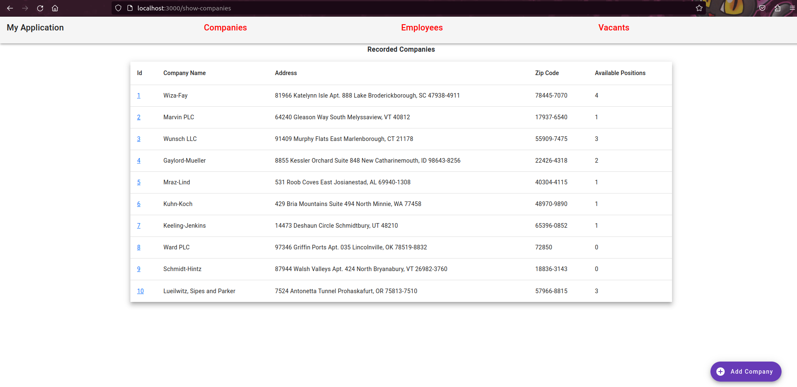

# Installation method #1 (Docker)

## Requirements

- Docker
- Git

## Running process

- clone the repository `https://github.com/jdbuenol/TestParrolabs.git`
- access the repository `cd TestParrolabs`
- run the docker containers with the build flag `sudo docker compose up --build -d`
- run the laravel migrations `sudo docker exec testparrolabs-backend-1 php artisan migrate`
- (optional) run the laravel seeders to poblate the database `sudo docker exec testparrolabs-backend-1 php artisan db:seed` as many times as you like
- access the frontend application running in port 3000: 